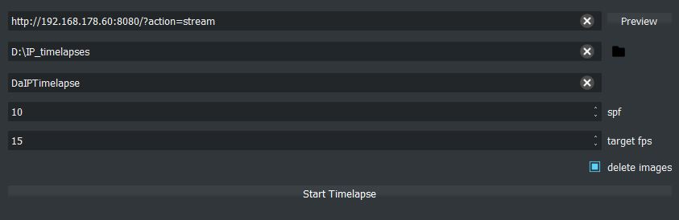
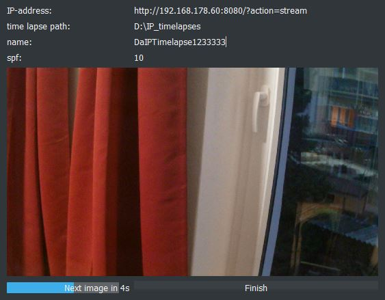

# DaIPTimelapse
DaIPTimelapse is a simple tool to create timelapses from IP-Cameras. </br>
It is easy to use and is able to capture multiple time lapses at once. </br>
 Create Time Lapse                  | Running Time Lapse
------------------------------------|----
  | 


## Quick Start
First you need to download the [matching version](##Executables) of the tool from [here](https://github.com/CaptainDario/DaIPTimelapse/releases). </br>
Now you are ready to start capturing some time lapses.</br>

## Executables
There are two executables provided. </br>
* DaIPTimelapse_vX.X_folder - this is a folder which contains all necessary files 
* DaIPTimelapse_vX.X_file - this is only **one** file which contains all files but has a way longer startup time
**Note:** </br>
Currently only executables for windows are available.

## Running from source

This should only be necessary if:
* you want to add your own features or
* there is currently no executable provided for your platform

*If there is no executable provided please add a build procedure to the 'build_executables.py' and open a pull request.*
</br>
</br>
First you need to download this repository.
And second all packages from the requirements.txt need to be installed.

```
python -m pip install -r requirement.txt
```
now you should be able to run your program with:
```
python ./src/main.py
```

## Ideas and next steps

[Here](https://github.com/CaptainDario/DaIPTimelapse/projects/1) you can see the currently planned features for this project.

## Development notes

For development Python 3.9 was used.

## Credits
The icons used are taken from the [Google Material Design Icons Set](https://material.io/resources/icons/). </br>
The dark color scheme was kindly made public by [Alexander Huszagh](https://github.com/Alexhuszagh/BreezeStyleSheets) </br>
